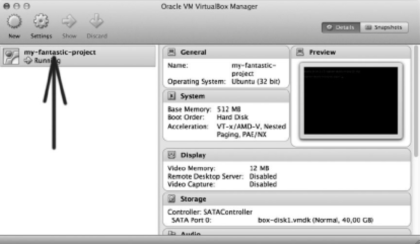
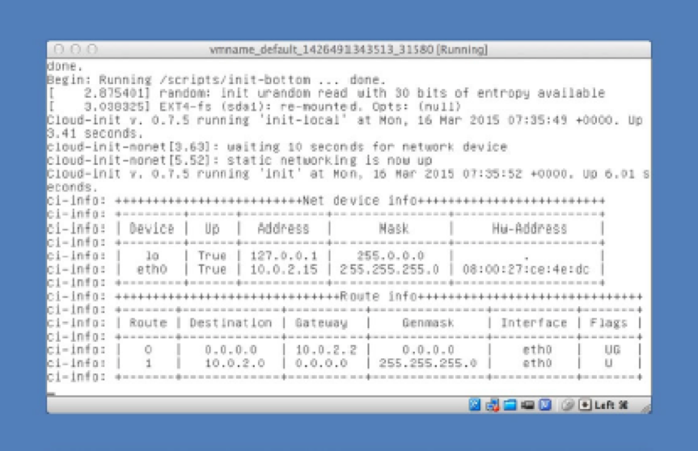
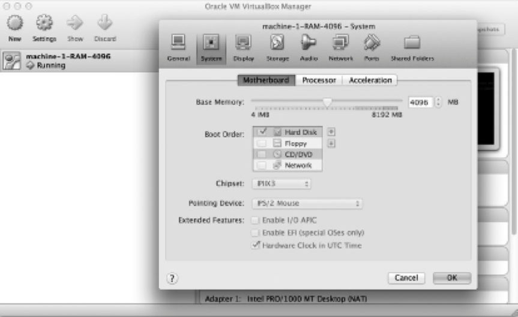

## VirtualBox-Related Configuration
VirtualBox vous permet de redéfinir les paramètres de configuration suivants:
•	VM name
•	Graphical user interface (GUI) mode
•	Physical properties of a VM

### VM Name
Pour définir le nom de la VM sur my-fantastic-project, utilisez le code indiqué ci-dessous.
En d'autres termes, la variable `v.name` vous permet d'interagir avec le nom défini.
```ruby
Vagrant.configure(2) do |config|
  config.vm.box = "ubuntu/trusty32"   
  config.vm.provider "virtualbox" do |v|
    v.name = "my-fantastic-project"
  end
end
```
Lorsque vous démarrez la machine en utilisant le Vagrantfile avec $ vagrant up, la sortie comprendra le message suivant:
```
==> default: Setting the name of the VM: my-fantastic-project
```
Que se passe-t-il si vous utilisez le même nom dans deux projets différents? Rien d'interessant. Vous verrez ce message d'erreur:

A VirtualBox machine with the name 'my-fantastic-project' already exists.
Please use another name or delete the machine with the existing name, and try again.

Le nom de la machine est affiché dans VirtualBox.


Le nom de la VM est important pour le packaging seulement.

### GUI Mode

Par défaut, VirtualBox démarre les machines en mode headless, ce qui signifie qu'il n'y a pas d'interface pour accéder au système d'exploitation guest. La seule façon de le faire est d'utiliser SSH. Vous pouvez changer ce comportement en utilisant la variable de configuration de l'interface graphique:
```ruby
Vagrant.configure(2) do |config|
  config.vm.box = "ubuntu/trusty32"   
  config.vm.provider "virtualbox" do |v|
    v.gui = true
  end
end
```
Lorsque vous démarrez la machine en utilisant la configuration indiquée ci-dessus, VirtualBox démarrera la console en GUI. Bien qu’il s’agisse d’un terminal typique qui n’offre aucun avantage par rapport à la console SSH, il peut être utile en cas de problème. Les messages affichés dans la console GUI peuvent vous aider à identifier le problème.



### RAM

La quantité de RAM affectée à une machine virtuelle peut être définie avec la variable de mémoire. L'invité utilisant la configuration suivante dispose de 4 Go de RAM.
```
Vagrant.configure(2) do |config|
  config.vm.box = "ubuntu/trusty32"   
  config.vm.provider "virtualbox" do |v|
    v.memory = 4096
  end
end
```
Lorsque vous démarrez la machine configurée ci-dessus, vous pouvez vérifier la quantité de RAM dans l'invité avec les commandes suivantes:
```
# Guest OS
$ free m
$ cat /proc/meminfo
$ sudo lshw
```


Par défaut, Vagrant alloue 512 Mo pour chaque machine virtuelle. Donc, si vous ignorez la variable mémoire, cela équivaut à ceci:
  v.memory = 512

Quelle quantité de RAM devez-vous attribuer à votre machine virtuelle? Vous devez prendre en compte quelques facteurs:
  • La quantité de RAM de votre machine physique
  • La quantité de RAM consommée par les outils que vous utilisez

### Number of CPUs
Si vous travaillez sur une machine multiprocesseur, vous pouvez limiter le nombre de processeurs à utiliser par le système invité
```
Vagrant.configure(2) do |config|
  config.vm.box = "ubuntu/trusty32"   
  config.vm.provider "virtualbox" do |v|
    v.memory = 4096
    v.cpu = 2
  end
end
```
VirtualBox n'utilisera que deux processeurs pour exécuter cette VM particulière, même si votre machine en possède quatre. Dans la plupart des cas, vous devez utiliser tous les processeurs. Et, bien sûr, utiliser une valeur supérieure au nombre de processeurs installés sur votre ordinateur ne servira à rien car VirtualBox la diminuera.

### General Settings

Voici la configuration générale d'une VM:
•	Hostname
•	Post-up message
•	Booting and halting timeouts
•	SSH configuration
•	Base box settings

#### Hostname
Pour définir le nom de votre hôte sur abc.example.lh, utilisez le code suivant:
```
Vagrant.configure(2) do |config|
  config.vm.box = "ubuntu/trusty32"   
  config.vm.hostname = "abc.example.lh"
end
```

Dans le système d'exploitation invité, la commande suivante:
```
# Guest OS
$ hostname -f
```
affichera
abc.example.lh

#### Post-up Messages
La variable config.vm.post_up_message peut être utilisée pour afficher un message lorsque le démarrage est terminé. C'est un endroit idéal pour montrer à vos utilisateurs comment accéder à l'application.
```
Vagrant.configure(2) do |config|
  config.vm.box = "ubuntu/trusty32"
  config.vm.post_up_message = "The application is available at http://abc.example.lh:8765"

end
```
L'affichage après le boot:
```
==> default: Machine 'default' has a post `vagrant up` message. This is a message
==> default: from the creator of the Vagrantfile, and not from Vagrant itself:
==> default:
==> default: The application is available at http://abc.example.lh:8765
```
#### SSH
Les propriétés de base des sessions SSH ouvertes par la commande $ vagrant ssh sont régies par les paramètres suivants:

config.ssh.username
config.ssh.password
config.ssh.host
config.ssh.port
config.ssh.private_key_path

Ils définissent le nom d'utilisateur, le mot de passe, l'hôte, le port et la clé privée. Avec ces options, vous pouvez éviter d'utiliser des informations d'identification prédéfinies et connues du public.

#### Base Box
Il y a deux variables importantes qui configurent le box de base:
config.vm.box
config.vm.box_url

Le premier définit le nom de le box. La valeur attribuée à config.vm.box peut prendre l'une des trois formes suivantes:
* The vendor/name (for example, ubuntu/trusty32); this name is resolved into an URL by atlas.hashicorp.com
```
Vagrant.configure(2) do |config|
  config.vm.box = "ubuntu/trusty32"
end
```
* The valid URL; for example, http://boxes.gajdaw.pl/apache/apache-v1.0.0.box
```
Vagrant.configure(2) do |config|
  config.vm.box = "http://boxes.gajdaw.pl/apache/apache-v1.0.0.box"
end
```
* The name, such as rails-my-shop; the name of the box already installed in the system
```
Vagrant.configure(2) do |config|
  config.vm.box = "apache-v1.0.0"
end
```
### Networking

Il existe trois façons de communiquer avec votre machine virtuelle invitée à l'aide du réseau:
*	Port forwarding
*	Private networks
*	Public networks

#### Port Forwarding

Il s'agit de l'approche la plus simple pour configurer la communication hôte-invité. Elle présente deux avantages par rapport aux autres méthodes: Vagrant ne pose aucune question lors du démarrage et vous n’avez pas besoin de privilèges d’administrateur pour démarrer la machine. Mais elle présente aussi quelques inconvénients:
* Vous devez définir chaque port transféré manuellement.
* Il s'agit d'un canal de communication qui provient du côté hôte; vous ne pouvez pas     
  l'utiliser pour NFS ou X11 car la redirection de port ne permet pas à l'invité de communiquer avec les services exécutés sur l'hôte.

#### Private Networks
En utilisant des réseaux privés, vous pouvez effectuer les opérations suivantes:
* Évitez de saisir la configuration de chaque port transféré séparément
* Évitez d’utiliser des numéros de port tels que 8800 pour des services connus
* Utilisez les mêmes numéros de port dans différents projets
* Communiquez entre plusieurs invités
* Utiliser NFS pour les répertoires partagés

Ce sont les principaux avantages. L'inconvénient le plus important est qu'en fonction de votre système d'exploitation hôte et de sa configuration, vous devrez peut-être répondre à certaines questions lors du démarrage, ce qui peut être un problème pour vous.

**Manual Configuration of Private Networking**
```
Vagrant.configure(2) do |config|
  config.vm.box = "ubuntu/trusty32"
  config.vm.network "private_network", ip: "10.20.30.40"
end```

**Listing 8-19. Private Networking Configured with DHCP**
```
Vagrant.configure(2) do |config|
  config.vm.box = "ubuntu/trusty32 "
  config.vm.network "private_network", type: "dhcp"
end
```
